# BOR Write Ecosystem -- System Map

> Auto-generated from `archviz-summary.json` on 2026-02-13.
> Source: `/Users/saima.khan/workspace/oncall-kb/architecture/archviz-summary.json`

---

## Table of Contents

- [1. High-Level Overview](#1-high-level-overview)
- [2. Service Catalog (28 Services)](#2-service-catalog-28-services)
  - [2.1 Balance Service](#21-balance-service)
  - [2.2 Balance Service: REST API](#22-balance-service-rest-api)
  - [2.3 Balance Service: GraphQL API](#23-balance-service-graphql-api)
  - [2.4 Balance Service: Transaction Stream](#24-balance-service-transaction-stream)
  - [2.5 Balance Service: Order Kafka Consumer V2](#25-balance-service-order-kafka-consumer-v2)
  - [2.6 Balance Service: Margin Metrics Worker](#26-balance-service-margin-metrics-worker)
  - [2.7 Oracle GL Publisher](#27-oracle-gl-publisher)
  - [2.8 Oracle GL Publisher: Queue Processor](#28-oracle-gl-publisher-queue-processor)
  - [2.9 Oracle GL Publisher: Grouped Activities Processor](#29-oracle-gl-publisher-grouped-activities-processor)
  - [2.10 Oracle GL Publisher: Batched Activities Processor](#210-oracle-gl-publisher-batched-activities-processor)
  - [2.11 Oracle GL Publisher: API](#211-oracle-gl-publisher-api)
  - [2.12 Oracle GL Publisher: Audit Status Processor](#212-oracle-gl-publisher-audit-status-processor)
  - [2.13 SO-Orders](#213-so-orders)
  - [2.14 Accounting Flink Jobs](#214-accounting-flink-jobs)
  - [2.15 Accounting Flink Jobs: TX Streamer](#215-accounting-flink-jobs-tx-streamer)
  - [2.16 Accounting Flink Jobs: Activity Classifier](#216-accounting-flink-jobs-activity-classifier)
  - [2.17 Accounting Flink Jobs: Positions Calculator](#217-accounting-flink-jobs-positions-calculator)
  - [2.18 Accounting Flink Jobs: Net Deposits Calculator](#218-accounting-flink-jobs-net-deposits-calculator)
  - [2.19 Kratos](#219-kratos)
  - [2.20 Ledge](#220-ledge)
  - [2.21 Fort Knox](#221-fort-knox)
  - [2.22 Crypto Service](#222-crypto-service)
  - [2.23 Fully Paid Lending Service](#223-fully-paid-lending-service)
  - [2.24 Inquery](#224-inquery)
  - [2.25 Poseidon](#225-poseidon)
  - [2.26 Risk Service](#226-risk-service)
  - [2.27 Interest Rate Service](#227-interest-rate-service)
  - [2.28 Investment Profile Service](#228-investment-profile-service)
- [3. Architecture Diagrams (Mermaid)](#3-architecture-diagrams-mermaid)
  - [3.1 All Services Overview](#31-all-services-overview)
  - [3.2 Orders and Trading Flow](#32-orders-and-trading-flow)
  - [3.3 Accounting and GL Flow](#33-accounting-and-gl-flow)
  - [3.4 Balance and Position Flow](#34-balance-and-position-flow)
  - [3.5 Funding and Lending Flow](#35-funding-and-lending-flow)
  - [3.6 Balance Service -- Architecture](#36-balance-service----architecture)
  - [3.7 Balance Service -- Data Flow](#37-balance-service----data-flow)
  - [3.8 Oracle GL Publisher -- Architecture](#38-oracle-gl-publisher----architecture)
  - [3.9 Oracle GL Publisher -- Flow](#39-oracle-gl-publisher----flow)
  - [3.10 Accounting Flink Jobs -- Pipeline](#310-accounting-flink-jobs----pipeline)
  - [3.11 Accounting Flink Jobs -- Flow](#311-accounting-flink-jobs----flow)
  - [3.12 SO-Orders -- Architecture](#312-so-orders----architecture)
  - [3.13 Fort Knox -- Architecture](#313-fort-knox----architecture)
  - [3.14 Crypto Service -- Architecture](#314-crypto-service----architecture)
  - [3.15 Fully Paid Lending -- Architecture](#315-fully-paid-lending----architecture)
  - [3.16 Inquery -- Architecture](#316-inquery----architecture)
  - [3.17 Risk Service -- Architecture](#317-risk-service----architecture)
  - [3.18 Kratos -- Architecture](#318-kratos----architecture)
  - [3.19 Poseidon -- Architecture (Deprecating)](#319-poseidon----architecture-deprecating)
  - [3.20 Ledge -- Architecture](#320-ledge----architecture)
  - [3.21 Interest Rate Service -- Architecture](#321-interest-rate-service----architecture)
  - [3.22 Investment Profile Service -- Architecture](#322-investment-profile-service----architecture)
- [4. Stories / Walkthroughs](#4-stories--walkthroughs)
  - [4.1 How Real-Time Balances Work](#41-how-real-time-balances-work)
  - [4.2 How an Order Gets Placed and Settled](#42-how-an-order-gets-placed-and-settled)
- [5. Node Categories](#5-node-categories)
  - [5.1 Kafka Topics](#51-kafka-topics)
  - [5.2 APIs](#52-apis)
  - [5.3 Databases and Storage](#53-databases-and-storage)
- [6. Deep Dive: Ledge, Oracle GL Publisher, and SO-Orders](#6-deep-dive-ledge-oracle-gl-publisher-and-so-orders)
  - [6.1 Relationship Overview](#61-relationship-overview)
  - [6.2 Ledge](#62-ledge-1)
  - [6.3 Oracle GL Publisher](#63-oracle-gl-publisher-1)
  - [6.4 SO-Orders](#64-so-orders-1)
  - [6.5 How They Connect](#65-how-they-connect)

---

## 1. High-Level Overview

The **BOR Write ecosystem** is Wealthsimple's financial backbone. It spans the full lifecycle of money and securities -- from the moment a user taps "Buy" in the mobile app to the final journal entry in Oracle General Ledger and the analytics row in the Kratos data warehouse.

The ecosystem is organized into four architectural layers:

| Layer | Purpose | Key Services |
|---|---|---|
| **Client Applications** | User-facing interfaces | Mobile, Web, Back-Office |
| **API Layer** | User-facing service APIs | Balance Service API, Fort Knox, SO-Orders, Crypto Service, Investment Profile Service, Risk Service |
| **Processing Layer** | Background and streaming processing | Oracle GL Publisher, Accounting Flink Jobs, Interest Rate Service, Fully Paid Lending, Ledge |
| **Data Layer** | Storage and analytics | Oracle GL, Kratos, PostgreSQL databases, Inquery, Poseidon (legacy) |

The central data flow is:

1. **Business events** originate from trading (SO-Orders), funding (Fort Knox), crypto (Crypto Service), interest (Interest Rate Service), lending (Fully Paid Lending), and manual entries (Ledge).
2. **Oracle GL Publisher** transforms these events into standardized GL journal entries and books them to **Oracle GL**.
3. **Balance Service** maintains a real-time materialized view of Oracle GL balances in PostgreSQL, serving instant buying-power queries.
4. **Accounting Flink Jobs** streams Oracle GL data through a classification and calculation pipeline into the **Kratos** data warehouse for analytics.
5. **Inquery** aggregates events from upstream services and serves financial activity data to frontend applications.

---

## 2. Service Catalog (28 Services)

### 2.1 Balance Service

| | |
|---|---|
| **ID** | `balance-service` |
| **Purpose** | Real-time source of truth for account buying power across Wealthsimple Trade, Invest, and Crypto products. Synchronizes data from multiple upstream systems (Oracle GL, Orders, Funding) to provide instant balance validation and reservation capabilities that are significantly faster than waiting for Oracle GL updates. |
| **Tech Stack** | Kotlin, Ktor (REST), Spring Boot + Netflix DGS (GraphQL), PostgreSQL (3 capsules), Redis, Apache Kafka, AWS Kinesis, Temporal, Datadog, LaunchDarkly |

**Key Functions:**
- **Real-Time Balance Tracking** -- Maintains a live materialized view of Oracle GL account balances
- **Balance Reservations** -- Atomic check-and-reserve operations preventing double-spending
- **Margin Calculations** -- Buying power computation with collateral haircuts and concentration limits
- **Future Deltas Management** -- Pending deposits, corporate actions that take effect at future dates

---

### 2.2 Balance Service: REST API

| | |
|---|---|
| **ID** | `balance-service.restapi` |
| **Purpose** | The REST API is the primary interface for synchronous balance operations. Built with Ktor, it provides endpoints for balance queries, atomic reservation creation, and activity recording. It is the gatekeeper that order services call to validate and reserve funds before executing trades. |
| **Tech Stack** | Ktor, Kotlin, PostgreSQL, kotlinx.serialization |

**Key Functions:**
- **Balance Reservations** -- Atomic check-and-reserve for trade execution
- **Activity Recording** -- Recording balance-impacting activities
- **Balance Queries** -- Full balance breakdowns for accounts

> *Node: RestAPI* -- Balance Service REST API (Ktor). Serves atomic check-and-reserve operations for trade execution and balance queries with full breakdowns.

---

### 2.3 Balance Service: GraphQL API

| | |
|---|---|
| **ID** | `balance-service.gql-api` |
| **Purpose** | The GraphQL API serves rich balance and margin data to frontend applications. Built with Spring Boot and Netflix DGS, it provides queries for account balances, margin metrics, and portfolio optimization solutions. This is the primary API for mobile and web apps to display balance information. |
| **Tech Stack** | Spring Boot 3.x, Netflix DGS Framework, Kotlin, PostgreSQL |

**Key Functions:**
- **Account Balance Queries** -- Rich balance data for frontends
- **Margin Metrics** -- Buying power, maintenance requirements, collateral values
- **Portfolio Solution** -- Portfolio optimization solutions
- **Activity Mutations** -- Balance-impacting mutation operations

> *Node: GqlAPI* -- Balance Service GraphQL API (Spring Boot + DGS). Serves rich balance and margin data to mobile and web apps including buying power and margin metrics.

---

### 2.4 Balance Service: Transaction Stream

| | |
|---|---|
| **ID** | `balance-service.transaction-stream` |
| **Purpose** | Transaction Stream is the primary ingestion component that consumes GL transaction data from Oracle (via Leapfrog Shovel) and updates live balances in PostgreSQL. It is the bridge between the Oracle GL system of record and the real-time balance cache. |
| **Tech Stack** | Spring Boot, Kafka Consumer, Kinesis Consumer, Kotlin, PostgreSQL |

**Key Functions:**
- **GL Transaction Processing** -- Consumes and applies GL transactions to live balances
- **Balance Updates** -- Updates PostgreSQL balance state from Oracle GL events
- **Checkpoint Management** -- Tracks processing position for recovery

> *Node: TxConsumer* -- Primary ingestion consumer that processes GL transaction data from Oracle via Leapfrog Shovel. Updates live balances in PostgreSQL.

---

### 2.5 Balance Service: Order Kafka Consumer V2

| | |
|---|---|
| **ID** | `balance-service.order-kafka-consumer-v2` |
| **Purpose** | Order Kafka Consumer V2 processes order execution events from SO-Orders to update balance reservations in real-time. When orders are filled or cancelled, this consumer adjusts reserved amounts and releases holds accordingly. |
| **Tech Stack** | Spring Boot, Kafka Consumer, Kotlin, PostgreSQL |

**Key Functions:**
- **Order Fill Processing** -- Adjusts balances on trade fills
- **Order Cancellation** -- Releases reservations when orders are cancelled
- **Partial Fills** -- Handles incremental reservation adjustments

> *Node: OrderConsumerV2* -- Processes order execution events from SO-Orders to update balance reservations in real-time. Handles fills, cancellations, and partial fills.

---

### 2.6 Balance Service: Margin Metrics Worker

| | |
|---|---|
| **ID** | `balance-service.margin-metrics-worker` |
| **Purpose** | Margin Metrics Worker is a Temporal workflow that computes margin metrics for eligible accounts. It calculates buying power, maintenance requirements, and generates reports for the data warehouse. This enables risk monitoring and margin call detection. |
| **Tech Stack** | Spring Boot, Temporal, Kotlin, PostgreSQL, AWS S3 |

**Key Functions:**
- **Margin Metrics Calculation** -- Buying power, maintenance requirements, collateral values with haircuts
- **Portfolio Solution Engine** -- Optimization solutions for margin accounts
- **Report Generation** -- Data warehouse reports for margin monitoring

> *Node: MarginMetrics* -- Temporal workflow computing margin metrics for eligible accounts -- buying power, maintenance requirements, collateral values with haircuts.

---

### 2.7 Oracle GL Publisher

| | |
|---|---|
| **ID** | `oracle-gl-publisher` |
| **Purpose** | Oracle GL Publisher is the financial data transformation and booking service that converts business activities into Oracle General Ledger (GL) entries. It acts as the critical hub in the financial data pipeline, receiving events from various business systems (funding, trading, lending, crypto) and creating standardized GL journal entries in Oracle for real-time accounting updates. |
| **Tech Stack** | Kotlin 2.3.0, Spring Boot 3.5.7, Maven, Apache Kafka, Confluent Schema Registry, Netflix DGS, PostgreSQL (app state), Oracle (GL target), Hibernate 6.3, Liquibase |

**Key Functions:**
- **Activity Ingestion** -- Consumes financial activities from Kafka (60+ activity types)
- **GL Record Generation** -- 44+ specialized Impact Builders transform activities into debit/credit entries
- **Multi-Path Processing** -- Direct write, grouped import, and batched import paths
- **Audit Event Routing** -- Publishes booking confirmations to 8+ service-specific Kafka topics

> *Node: GLPublisher* -- Mission-critical financial booking hub transforming business activities into Oracle GL journal entries. 60+ activity types, 44+ Impact Builders.

---

### 2.8 Oracle GL Publisher: Queue Processor

| | |
|---|---|
| **ID** | `oracle-gl-publisher.queue-processor` |
| **Purpose** | The Queue Processor is the main ingress component that consumes activities from Kafka, transforms them into GL records using Impact Builders, and routes them to the appropriate processing path. It is the entry point for all financial activities entering the GL system. |
| **Tech Stack** | Spring Boot, Kafka Streams, Kotlin, Avro |

**Key Functions:**
- **Activity Consumption** -- Reads from the gl-publisher-tx-ingress-stream Kafka topic
- **GL Record Generation** -- Selects the correct Impact Builder for each activity type
- **Routing Decision** -- Routes to direct, grouped, or batched processing paths
- **Audit Event Production** -- Publishes to audit-lite Kafka topic

> *Node: QueueProc* -- Main ingress stream processor consuming activities from Kafka, selecting Impact Builders, and routing to direct, grouped, or batched processing.

---

### 2.9 Oracle GL Publisher: Grouped Activities Processor

| | |
|---|---|
| **ID** | `oracle-gl-publisher.grouped-activities-processor` |
| **Purpose** | The Grouped Activities Processor optimizes GL imports by batching similar activities together. It polls for activities with NEW status, groups them by payload type, and imports them as a single GL batch. This significantly reduces the number of Oracle imports and improves system performance. |
| **Tech Stack** | Spring Boot, @Scheduled, Kotlin |

**Key Functions:**
- **Activity Polling** -- Polls PostgreSQL for NEW-status activities
- **Grouped Import** -- Groups by type and imports as a single batch
- **Activity Types Handled** -- Funding, interest, lending, and other non-order activities

> *Node: GroupedProc* -- Optimizes GL imports by grouping NEW activities by type and importing each group as a single Oracle GL batch.

---

### 2.10 Oracle GL Publisher: Batched Activities Processor

| | |
|---|---|
| **ID** | `oracle-gl-publisher.batched-activities-processor` |
| **Purpose** | The Batched Activities Processor handles activities that require batch completion before GL import. Typically used for order-related activities where multiple transactions must be booked together. It monitors batch readiness and triggers imports when all activities in a batch are received. |
| **Tech Stack** | Spring Boot, Scheduled jobs, Kotlin |

**Key Functions:**
- **Batch Readiness Checking** -- Monitors when all activities in a batch have arrived
- **Batch Import** -- Imports the complete batch as a single GL operation
- **Completion Verification** -- Ensures books balance before import

> *Node: BatchedProc* -- Handles activities requiring batch completion before GL import. Monitors readiness, waits for all expected activities, then imports.

---

### 2.11 Oracle GL Publisher: API

| | |
|---|---|
| **ID** | `oracle-gl-publisher.api` |
| **Purpose** | The API provides a GraphQL interface for operational management of the GL Publisher. It enables reprocessing of failed activities, processing reversals, monitoring import status, and querying activity history. |
| **Tech Stack** | Spring Boot, Netflix DGS, Kotlin |

**Key Functions:**
- **Failed Activity Reprocessing** -- Retry failed GL imports
- **Reversal Processing** -- Process accounting reversals
- **Book Value Updates** -- Correct book values
- **Status Monitoring** -- Monitor GL import pipeline health

> *Node: API* -- GL Publisher GraphQL API (Spring Boot + DGS) for reprocessing failed activities, reversals, book value updates, and monitoring.

---

### 2.12 Oracle GL Publisher: Audit Status Processor

| | |
|---|---|
| **ID** | `oracle-gl-publisher.audit-status-processor` |
| **Purpose** | The Audit Status Processor routes audit events from the central audit topic to service-specific Kafka topics. This allows upstream services to receive targeted notifications when their activities are successfully booked to Oracle GL. |
| **Tech Stack** | Spring Boot, Kafka Streams, Kotlin |

**Key Functions:**
- **Audit Event Routing** -- Routes from central audit-lite topic to 8+ service-specific topics
- **Source Identification** -- Identifies which upstream service originated each activity
- **Specialized Processors** -- Dedicated routing for Fort Knox, Orders, Settlement, etc.

> *Node: AuditProc* -- Routes audit events from central audit-lite topic to 8+ service-specific Kafka topics so upstream services know when activities are booked.

---

### 2.13 SO-Orders

| | |
|---|---|
| **ID** | `so-orders` |
| **Purpose** | SO-Orders is Wealthsimple's order execution and management system providing APIs for order submission, tracking, and processing across multiple trading platforms. It handles the full order lifecycle from client submission through execution on FIX brokers, Bloomberg EMSX, and fund servicing platforms. |
| **Tech Stack** | Java 21, Kotlin, Dropwizard/Guice (legacy), Spring Boot 3.5.7 (new), Maven, PostgreSQL, Oracle, Kafka, SQS, Temporal |

**Key Functions:**
- **Order Submission** -- REST and GraphQL APIs for client and internal order submission
- **Order Routing** -- Routes to FIX brokers, Bloomberg EMSX, or Fundserv based on instrument type
- **Order Lifecycle** -- Full lifecycle management from pending through execution to settlement
- **GL Posting** -- Publishes completed order activities to GL Publisher for accounting

> *Node: SOOrders* -- Order execution and management system handling the full order lifecycle from client submission through FIX broker execution.

---

### 2.14 Accounting Flink Jobs

| | |
|---|---|
| **ID** | `accounting-flink-jobs` |
| **Purpose** | Accounting Flink Jobs is a real-time streaming data processing system built on Apache Flink that processes financial accounting data from Oracle, transforms it into standardized activities, calculates derived metrics (positions, returns, net deposits), and materializes results to the Kratos data warehouse. |
| **Tech Stack** | Apache Flink 1.20.2, Kotlin + Java, Gradle, Avro with Fory, Apache Kafka, Oracle (source), PostgreSQL (sink), Temporal |

**Key Functions:**
- **Transaction Streaming** -- Loads and enriches Oracle GL transactions
- **Activity Classification** -- Standardizes transactions into ClientActivityV2 models
- **Position Calculation** -- Computes quantities, book values, market values, realized PnL
- **Net Deposits Calculation** -- Tracks money flows in/out of accounts
- **Materialization** -- Writes results to Kratos data warehouse

> *Node: FlinkJobs* -- Real-time streaming system on Apache Flink transforming Oracle GL data into standardized activities, positions, returns, and net deposits.

---

### 2.15 Accounting Flink Jobs: TX Streamer

| | |
|---|---|
| **ID** | `accounting-flink-jobs.tx-streamer` |
| **Purpose** | TX Streamer is the ingestion job that loads transaction batches from Oracle and enriches them with external data (market prices, FX rates, order info). It is the entry point of the Flink pipeline, transforming raw Oracle data into enriched transactions ready for classification. |
| **Tech Stack** | Apache Flink, Kotlin, Oracle JDBC |

**Key Functions:**
- **Batch Loading** -- Loads transaction batches from Oracle
- **Transaction Enrichment** -- Enriches with market prices, FX rates, order data
- **Processing Modes** -- Supports batch and incremental processing

> *Node: TxStreamer* -- Flink ingestion job loading transaction batches from Oracle and enriching with market prices, FX rates, and order data.

---

### 2.16 Accounting Flink Jobs: Activity Classifier

| | |
|---|---|
| **ID** | `accounting-flink-jobs.activity-classifier` |
| **Purpose** | Activity Classifier transforms raw Oracle transactions into standardized ClientActivityV2 models. It classifies transaction types, handles reversals and reclassifications, and reconciles with real-time FinancialActivityModel events to produce a canonical activity stream. |
| **Tech Stack** | Apache Flink, Kotlin, Avro |

**Key Functions:**
- **Transaction Classification** -- Maps Oracle transactions to canonical activity types
- **Reversal Handling** -- Detects and processes accounting reversals
- **Event Reconciliation** -- Reconciles with FinancialActivityModel real-time events
- **Batch Aggregation** -- Aggregates related transactions

> *Node: ActivityClassifier* -- Flink job transforming Oracle transactions into standardized ClientActivityV2 models. Classifies types, handles reversals.

---

### 2.17 Accounting Flink Jobs: Positions Calculator

| | |
|---|---|
| **ID** | `accounting-flink-jobs.positions-calculator` |
| **Purpose** | Positions Calculator computes current positions from the activity stream. It tracks quantities, book values, market values, and calculates realized returns (PnL) when positions are closed. This is the core calculation engine for portfolio analytics. |
| **Tech Stack** | Apache Flink, Kotlin, Keyed state (account_id or identity_id) |

**Key Functions:**
- **Position Tracking** -- Tracks quantities and book values per security per account
- **Market Value Calculation** -- Computes current market values
- **Realized Return Calculation** -- Calculates PnL on closed positions
- **Cross-Account Aggregation** -- Aggregates across accounts for identity-level views

> *Node: PositionsCalc* -- Flink job computing positions from the activity stream -- quantities, book values, market values, and realized PnL.

---

### 2.18 Accounting Flink Jobs: Net Deposits Calculator

| | |
|---|---|
| **ID** | `accounting-flink-jobs.net-deposits` |
| **Purpose** | Net Deposits Calculator tracks deposit and withdrawal activity to compute net deposit metrics. This enables tracking of money flows in and out of accounts over time, essential for performance calculations and regulatory reporting. |
| **Tech Stack** | Apache Flink, Kotlin |

**Key Functions:**
- **Deposit Tracking** -- Tracks all deposit activities
- **Withdrawal Tracking** -- Tracks all withdrawal activities
- **Net Calculation** -- Computes net deposit metrics over time

> *Node: NetDeposits* -- Flink job tracking deposit and withdrawal activity to compute net deposit metrics for performance and regulatory reporting.

---

### 2.19 Kratos

| | |
|---|---|
| **ID** | `kratos` |
| **Purpose** | Kratos is the data warehouse and persistence layer that stores processed financial data from the accounting-flink-jobs streaming pipeline. It materializes streaming data into PostgreSQL tables, making it available to downstream services like Financial Metrics Service and data warehouse syncing tools. |
| **Tech Stack** | PostgreSQL, Liquibase, KratosTablesGenerator.kts, Maven |

**Key Functions:**
- **Data Materialization** -- Stores classified activities, positions, returns, and net deposits
- **Table Versioning** -- Versioned tables for zero-downtime deployments and atomic cutover
- **Query Interface** -- Database views pointing to latest versioned tables for stable access

> *Node: Kratos* -- PostgreSQL data warehouse storing materialized financial data from the Flink pipeline -- activities, positions, returns, deposits.

---

### 2.20 Ledge

| | |
|---|---|
| **ID** | `ledge` |
| **Purpose** | Ledge is a back-office web application that replaces Oracle Forms for ledger management operations. It enables back-office users to perform GL entries, order posting, and bulk journal uploads through a modern web interface. |
| **Tech Stack** | Kotlin, Spring Boot 3.5.x, Vaadin Flow, Temporal, PostgreSQL, Oracle EBS, Gradle |

**Key Functions:**
- **Ledger Forms** -- Interactive web forms for GL journal entries, adjustments, and corrections
- **Bulk Journal Upload** -- CSV-based bulk uploads processed by Temporal workflows
- **Oracle Integration** -- Direct reads/writes to Oracle E-Business Suite

> *Node: Ledge* -- Back-office web application replacing Oracle Forms -- GL entries, order posting, and bulk CSV uploads via Vaadin UI.

---

### 2.21 Fort Knox

| | |
|---|---|
| **ID** | `fort-knox` |
| **Purpose** | Fort Knox is a funding and contribution room management service that handles deposits, withdrawals, internal transfers, and registered account contribution tracking. It is the central hub for money movement at Wealthsimple, managing payment methods and coordinating with custodians. |
| **Tech Stack** | Ruby, Ruby on Rails 8.0, GraphQL, PostgreSQL, Sidekiq Pro, SQS (Shoryuken), Temporal |

**Key Functions:**
- **Funding Requests** -- Deposits, withdrawals via EFT, e-Transfer, and wire transfer
- **Contribution Room Tracking** -- RRSP, TFSA, and IRA contribution limits
- **Payment Card Management** -- Card issuance, rewards, fees, insurance
- **Money Management** -- Internal transfers between a client's Wealthsimple accounts

> *Node: FortKnox* -- Funding and contribution room management -- deposits, withdrawals, internal transfers, and registered account contribution tracking.

---

### 2.22 Crypto Service

| | |
|---|---|
| **ID** | `crypto-service` |
| **Purpose** | Crypto Service provides cryptocurrency-related functionality for Wealthsimple's investment platform, including crypto trading, DeFi operations, and cryptocurrency transfers. It is a modular monolith built with Ruby on Rails using Packwerk for component boundaries. |
| **Tech Stack** | Ruby, Ruby on Rails 7.2, GraphQL, PostgreSQL, Sidekiq, Temporal, Packwerk modular monolith |

**Key Functions:**
- **Crypto Trading** -- Buy/sell market and limit orders for cryptocurrencies
- **Crypto Transfers** -- Internal transfers and external wallet withdrawals
- **DeFi Operations** -- Staking, yield farming, and blockchain protocol interactions
- **Trust Integration** -- Crypto holdings within trust account structures

> *Node: CryptoSvc* -- Cryptocurrency platform -- crypto trading, DeFi operations, and transfers as a Packwerk modular monolith.

---

### 2.23 Fully Paid Lending Service

| | |
|---|---|
| **ID** | `fully-paid-lending-service` |
| **Purpose** | Fully Paid Lending Service enables Wealthsimple clients to lend their fully-paid securities for interest income. It acts as an intermediary between Wealthsimple, Broadridge (securities lending platform), and clients, managing loan positions, collateral, and interest accruals. |
| **Tech Stack** | Kotlin, Spring Boot, GraphQL (Netflix DGS), Spring Batch, PostgreSQL, Temporal, Maven |

**Key Functions:**
- **Securities Lending** -- Clients lend securities for interest income
- **Broadridge Integration** -- SFCM file exchange for collateral, prices, PnL, interest
- **Loan Automation** -- Daily mark-to-market via Temporal workflows
- **Client Notifications** -- Loan status and interest earnings updates

> *Node: FPL* -- Fully Paid Lending service -- clients lend securities for interest income via Broadridge, with loan management and interest accruals.

---

### 2.24 Inquery

| | |
|---|---|
| **ID** | `inquery` |
| **Purpose** | Inquery is a presentational data GraphQL service that serves financial activity data to frontend applications. Built on PostGraphile, it auto-generates a GraphQL schema from its PostgreSQL database. The service is "informed, not informing" -- other services push data to it via Kafka. |
| **Tech Stack** | TypeScript, Node.js, Koa, PostGraphile v5, PostgreSQL with RLS, Graphile Migrate, Kafka |

**Key Functions:**
- **Auto-Generated GraphQL** -- Schema generated from PostgreSQL tables (no manual resolvers)
- **Event Consumption** -- Kafka consumers write upstream events into PostgreSQL
- **Row-Level Security** -- PostgreSQL RLS policies ensure users only see their own data

> *Node: Inquery* -- Presentational GraphQL service consuming events from upstream services via Kafka and serving financial activity data to frontends.

---

### 2.25 Poseidon

| | |
|---|---|
| **ID** | `poseidon` |
| **Purpose** | Poseidon is a legacy API and calculator service for investment-related activities and position calculations. It polls custodian services for activity changes, calculates positions with book values and returns, and serves this data via GraphQL API. *On deprecation path -- being replaced by Flink + Kratos + Financial Metrics.* |
| **Tech Stack** | Ruby Sinatra, GraphQL, PostgreSQL, Redis, Sidekiq (Enterprise), Ruby |

**Key Functions:**
- **Activity Polling** -- Polls custodian services (ShareOwner, Apex, SEI) for investment activities
- **Position Calculation** -- Handles stock splits, spinouts, book value tracking
- **Daily Value Calculation** -- Nightly batch (10:30 PM EST) computing daily net deposits and liquidation values
- **Pricing** -- Retrieves market prices from Security Master via Redis

> *Node: Poseidon* -- Legacy API and calculator service -- polls custodians for activities, calculates positions and returns. On deprecation path.

---

### 2.26 Risk Service

| | |
|---|---|
| **ID** | `risk-service` |
| **Purpose** | Risk Service is the central system for managing financial crime risks, fraud detection, and regulatory compliance across all Wealthsimple products. It handles risk decisions, mitigation actions, AML/KYC compliance, and FINTRAC regulatory reporting. |
| **Tech Stack** | Ruby, Ruby on Rails, GraphQL, PostgreSQL, Temporal, Sidekiq, Kafka, RailsEventStore |

**Key Functions:**
- **Fraud Detection and Investigation** -- Case management, investigation workflows
- **Risk Mitigation** -- Account liquidations, restrictions, limits, corrective actions
- **Margin Supervision** -- Margin call detection, auto-liquidation workflows
- **FINTRAC Reporting** -- Automated regulatory report submission via Temporal
- **IP Management** -- IP banning via Cloudflare, allowlists, automated ban expiry

> *Node: RiskSvc* -- Central financial crime risk management -- fraud detection, AML/KYC compliance, mitigation, margin supervision, FINTRAC reporting.

---

### 2.27 Interest Rate Service

| | |
|---|---|
| **ID** | `interest-rate-service` |
| **Purpose** | Interest Rate Service is responsible for calculating, storing, and processing interest, fees, and charges across Wealthsimple products. It handles daily interest calculations and monthly rollup of credits/debits to the ledger system. |
| **Tech Stack** | Ruby, Ruby on Rails, GraphQL, PostgreSQL, Sidekiq |

**Key Functions:**
- **Interest Calculation** -- Daily interest for chequing, HISA, HISP products
- **Fee Processing** -- Admin fees, management fees, gold storage fees
- **Margin Interest** -- Margin interest calculations
- **Tier Management** -- Interest rate tiers based on subscription, direct deposit, boost eligibility

> *Node: InterestSvc* -- Interest rate and fee calculation service -- daily interest calculations, fee processing, and monthly credit/debit rollups.

---

### 2.28 Investment Profile Service

| | |
|---|---|
| **ID** | `investment-profile-service` |
| **Purpose** | Investment Profile Service (IPS) is the portfolio management and suitability hub that manages client assessments, portfolio assignments, and investor policy statements. It is the source of truth for mapping clients to appropriate investment portfolios based on their risk profile. |
| **Tech Stack** | Ruby, Ruby on Rails, GraphQL, PostgreSQL, AWS S3, Temporal, Sidekiq |

**Key Functions:**
- **Client Suitability Assessment** -- Automated (Athena) and manual (PM) evaluation workflows
- **Portfolio Assignment** -- Maps client accounts to target portfolios
- **Investor Policy Statements** -- Generates compliant IPS PDFs cached on S3
- **Recurring Investments** -- Temporal workflows for scheduled contributions and dividend reinvestment

> *Node: IPS* -- Investment Profile Service -- client suitability assessments, portfolio assignments, and investor policy statement generation.

---

## 3. Architecture Diagrams (Mermaid)

The diagrams below are reconstructed from the archviz visualization data. Node descriptions from the `nodeDescriptions` object are included as comments.

### 3.1 All Services Overview

**Category:** overview

Layers: Client Apps (Mobile, Web, Back-Office) -> API Layer (User-facing services) -> Processing Layer (Background processing) -> Data Layer (Storage and analytics)

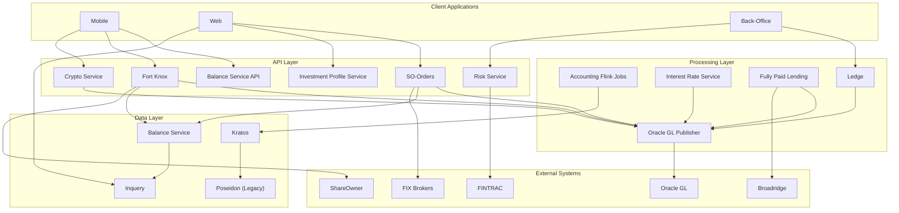
```mermaid
flowchart TD
    subgraph External["External Systems"]
        Oracle["Oracle GL"]
        Brokers["FIX Brokers"]
        ShareOwner["ShareOwner"]
        Broadridge["Broadridge"]
        FINTRAC["FINTRAC"]
    end

    subgraph DataLayer["Data Layer"]
        BalanceSvc["Balance Service"]
        Inquery["Inquery"]
        Kratos["Kratos"]
        Poseidon["Poseidon (Legacy)"]
    end

    subgraph ProcessingLayer["Processing Layer"]
        GLPublisher["Oracle GL Publisher"]
        FlinkJobs["Accounting Flink Jobs"]
        InterestSvc["Interest Rate Service"]
        FPL["Fully Paid Lending"]
        Ledge["Ledge"]
    end

    subgraph APILayer["API Layer"]
        BalanceAPI["Balance Service API"]
        FortKnox["Fort Knox"]
        SOOrders["SO-Orders"]
        CryptoSvc["Crypto Service"]
        IPS["Investment Profile Service"]
        RiskSvc["Risk Service"]
    end

    subgraph Clients["Client Applications"]
        Mobile["Mobile"]
        Web["Web"]
        BackOffice["Back-Office"]
    end

    Mobile --> BalanceAPI
    Mobile --> FortKnox
    Mobile --> CryptoSvc
    Web --> SOOrders
    Web --> IPS
    BackOffice --> Ledge
    BackOffice --> RiskSvc
    SOOrders --> GLPublisher
    FortKnox --> GLPublisher
    CryptoSvc --> GLPublisher
    InterestSvc --> GLPublisher
    FPL --> GLPublisher
    Ledge --> GLPublisher
    SOOrders --> BalanceSvc
    FortKnox --> BalanceSvc
    BalanceSvc --> Inquery
    Web --> Inquery
    FlinkJobs --> Kratos
    Kratos --> Poseidon
    GLPublisher --> Oracle
    SOOrders --> Brokers
    FortKnox --> ShareOwner
    FPL --> Broadridge
    RiskSvc --> FINTRAC
```

---

### 3.2 Orders and Trading Flow

**Category:** domain

Order Lifecycle: Client submits order via API -> Balance Service reserves funds -> SO-Orders routes to execution venue -> Fill received, balance updated -> GL Publisher books to Oracle.

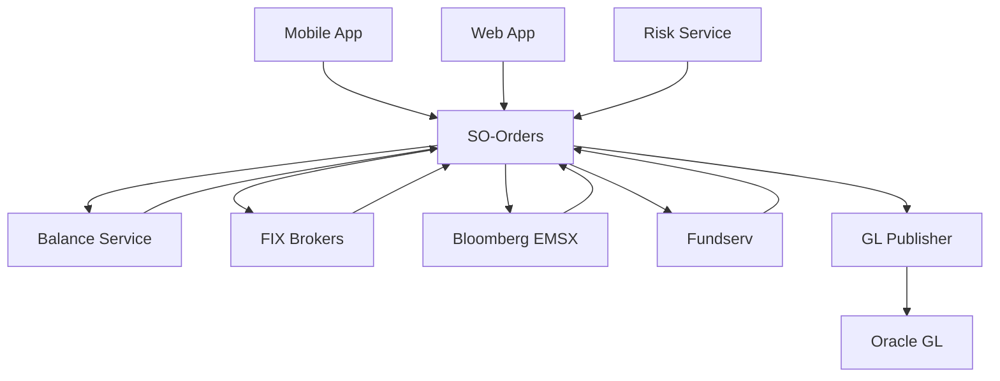
```mermaid
flowchart TD
    Mobile["Mobile App"] --> SOOrders["SO-Orders"]
    Web["Web App"] --> SOOrders
    SOOrders --> BalanceSvc["Balance Service"]
    BalanceSvc --> SOOrders
    RiskSvc["Risk Service"] --> SOOrders
    SOOrders --> FIX["FIX Brokers"]
    SOOrders --> Bloomberg["Bloomberg EMSX"]
    SOOrders --> Fundserv["Fundserv"]
    FIX --> SOOrders
    Bloomberg --> SOOrders
    Fundserv --> SOOrders
    SOOrders --> GLPublisher["GL Publisher"]
    GLPublisher --> Oracle["Oracle GL"]
```

---

### 3.3 Accounting and GL Flow

**Category:** domain

Activity Flow: Services publish activities to Kafka -> GL Publisher transforms to GL records -> Oracle GL Interface receives entries -> Flink streams from Oracle to Kratos. Sources: Fort Knox, SO-Orders, Crypto, Interest, FPL, Ledge.

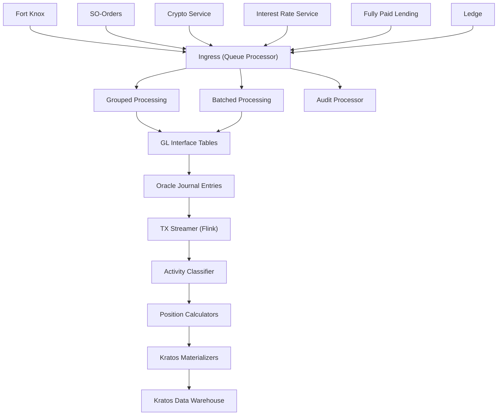
```mermaid
flowchart TD
    FortKnox["Fort Knox"] --> Ingress["Ingress (Queue Processor)"]
    SOOrders["SO-Orders"] --> Ingress
    CryptoSvc["Crypto Service"] --> Ingress
    InterestSvc["Interest Rate Service"] --> Ingress
    FPL["Fully Paid Lending"] --> Ingress
    Ledge["Ledge"] --> Ingress
    Ingress --> Grouped["Grouped Processing"]
    Ingress --> Batched["Batched Processing"]
    Ingress --> Audit["Audit Processor"]
    Grouped --> GLInterface["GL Interface Tables"]
    Batched --> GLInterface
    GLInterface --> JournalEntries["Oracle Journal Entries"]
    JournalEntries --> TxStreamer["TX Streamer (Flink)"]
    TxStreamer --> Classifier["Activity Classifier"]
    Classifier --> Calculators["Position Calculators"]
    Calculators --> Materializers["Kratos Materializers"]
    Materializers --> Kratos["Kratos Data Warehouse"]
```

---

### 3.4 Balance and Position Flow

**Category:** domain

Real-Time Path: Oracle -> Balance Service -> APIs -> Clients (sub-second balance updates). Analytics Path: Oracle -> Flink -> Kratos -> Services (historical positions and returns).

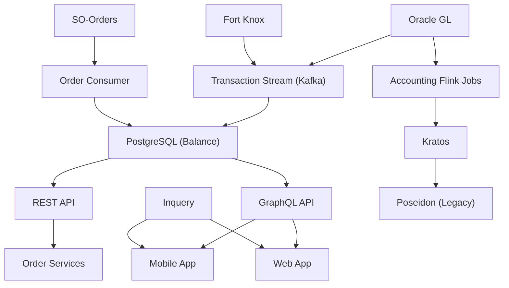
```mermaid
flowchart TD
    Oracle["Oracle GL"] --> TxStream["Transaction Stream (Kafka)"]
    SOOrders["SO-Orders"] --> OrderConsumer["Order Consumer"]
    FortKnox["Fort Knox"] --> TxStream
    TxStream --> PG_Balance["PostgreSQL (Balance)"]
    OrderConsumer --> PG_Balance
    PG_Balance --> RestAPI["REST API"]
    PG_Balance --> GqlAPI["GraphQL API"]
    RestAPI --> Orders["Order Services"]
    GqlAPI --> Mobile["Mobile App"]
    GqlAPI --> Web["Web App"]
    Inquery["Inquery"] --> Mobile
    Inquery --> Web
    Oracle --> FlinkJobs["Accounting Flink Jobs"]
    FlinkJobs --> Kratos["Kratos"]
    Kratos --> Poseidon["Poseidon (Legacy)"]
```

---

### 3.5 Funding and Lending Flow

**Category:** domain

Fort Knox (Funding): Deposits, withdrawals, transfers; contribution room tracking (RRSP/TFSA); payment provider integrations. FPL (Securities Lending): Broadridge SFCM integration; mark-to-market automation; interest accrual.

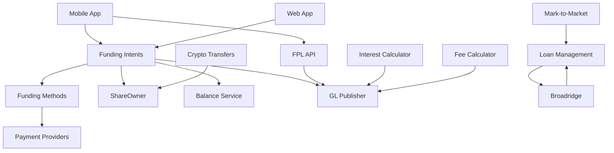
```mermaid
flowchart TD
    Mobile["Mobile App"] --> FundingIntents["Funding Intents"]
    Web["Web App"] --> FundingIntents
    Mobile --> FPLAPI["FPL API"]
    FundingIntents --> FundingMethods["Funding Methods"]
    FundingMethods --> PaymentProviders["Payment Providers"]
    FundingIntents --> ShareOwner["ShareOwner"]
    Transfers["Crypto Transfers"] --> ShareOwner
    FundingIntents --> BalanceSvc["Balance Service"]
    FundingIntents --> GLPublisher["GL Publisher"]
    LoanMgmt["Loan Management"] --> Broadridge["Broadridge"]
    Broadridge --> LoanMgmt
    MarkToMarket["Mark-to-Market"] --> LoanMgmt
    FPLAPI --> GLPublisher
    InterestCalc["Interest Calculator"] --> GLPublisher
    FeeCalc["Fee Calculator"] --> GLPublisher
```

---

### 3.6 Balance Service -- Architecture

**Category:** service

13 sub-services: REST and GraphQL APIs, Transaction Stream, Order Consumers, Margin Workers.

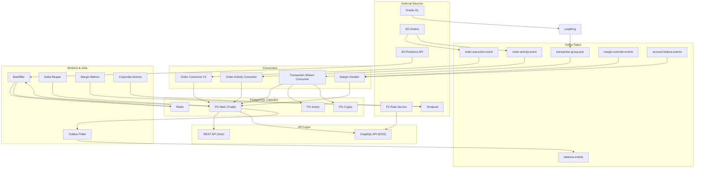
```mermaid
flowchart TD
    subgraph External["External Sources"]
        Oracle["Oracle GL"]
        SOOrders["SO-Orders"]
        SOPositions["SO-Positions API"]
        ForEx["FX Rate Service"]
        Temporal["Temporal"]
    end

    subgraph KafkaTopics["Kafka Topics"]
        TxStream["transaction-group-poc"]
        OrderExecution["order-execution-event"]
        OrderActivity["order-activity-event"]
        MarginOverride["margin-override-events"]
        AccountFeature["account-feature-events"]
        BalanceEvents["balance-events"]
    end

    subgraph Consumers["Consumers"]
        TxConsumer["Transaction Stream Consumer"]
        OrderConsumerV2["Order Consumer V2"]
        OrderActivityConsumer["Order Activity Consumer"]
        MarginHandler["Margin Handler"]
    end

    subgraph Workers["Workers & Jobs"]
        Backfiller["Backfiller"]
        DeltaReaper["Delta Reaper"]
        MarginMetrics["Margin Metrics"]
        CorpActions["Corporate Actions"]
        OutboxPoller["Outbox Poller"]
    end

    subgraph APIs["API Layer"]
        RestAPI["REST API (Ktor)"]
        GqlAPI["GraphQL API (DGS)"]
    end

    subgraph Storage["PostgreSQL Capsules"]
        PG_Main["PG Main (Trade)"]
        PG_Invest["PG Invest"]
        PG_Crypto["PG Crypto"]
        Redis["Redis"]
    end

    Oracle --> Leapfrog["Leapfrog"]
    Leapfrog --> TxStream
    TxStream --> TxConsumer
    SOOrders --> OrderExecution
    SOOrders --> OrderActivity
    OrderExecution --> OrderConsumerV2
    OrderActivity --> OrderActivityConsumer
    MarginOverride --> MarginHandler
    AccountFeature --> MarginHandler
    SOPositions --> Backfiller
    TxConsumer --> PG_Main
    TxConsumer --> PG_Invest
    TxConsumer --> PG_Crypto
    OrderConsumerV2 --> PG_Main
    OrderActivityConsumer --> PG_Main
    MarginHandler --> PG_Main
    Backfiller --> Redis
    Redis --> Backfiller
    Backfiller --> PG_Main
    DeltaReaper --> PG_Main
    MarginMetrics --> Temporal
    CorpActions --> Temporal
    PG_Main --> RestAPI
    PG_Main --> GqlAPI
    PG_Main --> OutboxPoller
    OutboxPoller --> BalanceEvents
    ForEx --> GqlAPI
```

---

### 3.7 Balance Service -- Data Flow

**Category:** service

Inputs: GL transactions from Oracle, Order events from SO-Orders, Margin configuration. Outputs: REST/GraphQL APIs, Kafka balance events.

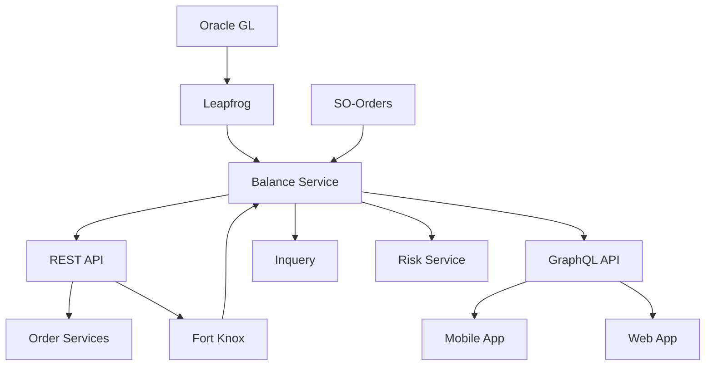
```mermaid
flowchart TD
    Oracle["Oracle GL"] --> Leapfrog["Leapfrog"]
    Leapfrog --> BS["Balance Service"]
    SOOrders["SO-Orders"] --> BS
    FortKnox["Fort Knox"] --> BS
    BS --> RestAPI["REST API"]
    BS --> GqlAPI["GraphQL API"]
    RestAPI --> Orders["Order Services"]
    RestAPI --> FortKnox
    GqlAPI --> Mobile["Mobile App"]
    GqlAPI --> Web["Web App"]
    BS --> Inquery["Inquery"]
    BS --> Risk["Risk Service"]
```

---

### 3.8 Oracle GL Publisher -- Architecture

**Category:** service

Processing Paths: Direct Write (immediate), Grouped Import (batched by type), Batched Import (order batches).

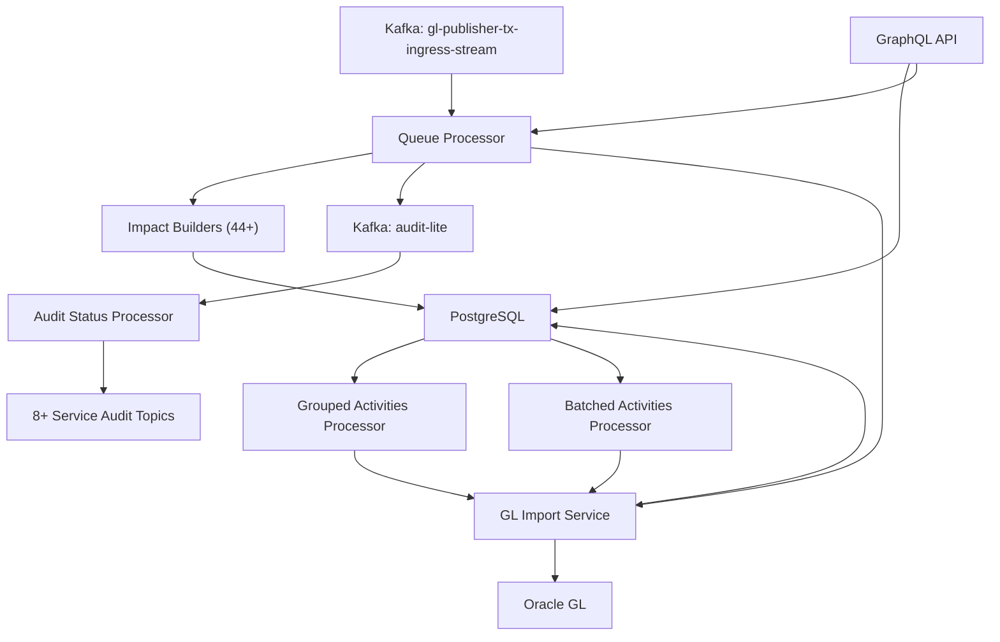
```mermaid
flowchart TD
    IngressTopic["Kafka: gl-publisher-tx-ingress-stream"]
    IngressTopic --> QueueProc["Queue Processor"]
    QueueProc --> ImpactBuilders["Impact Builders (44+)"]
    ImpactBuilders --> PG["PostgreSQL"]
    QueueProc --> AuditLite["Kafka: audit-lite"]
    PG --> GroupedProc["Grouped Activities Processor"]
    PG --> BatchedProc["Batched Activities Processor"]
    GroupedProc --> GLService["GL Import Service"]
    BatchedProc --> GLService
    QueueProc --> GLService
    GLService --> Oracle["Oracle GL"]
    GLService --> PG
    AuditLite --> AuditProc["Audit Status Processor"]
    AuditProc --> AuditTopics["8+ Service Audit Topics"]
    API["GraphQL API"] --> PG
    API --> QueueProc
```

---

### 3.9 Oracle GL Publisher -- Flow

**Category:** service

Sources: Fort Knox, Crypto, Orders, Interest, Lending, Ledge. Output: Oracle GL Interface tables, Audit events to Kafka.

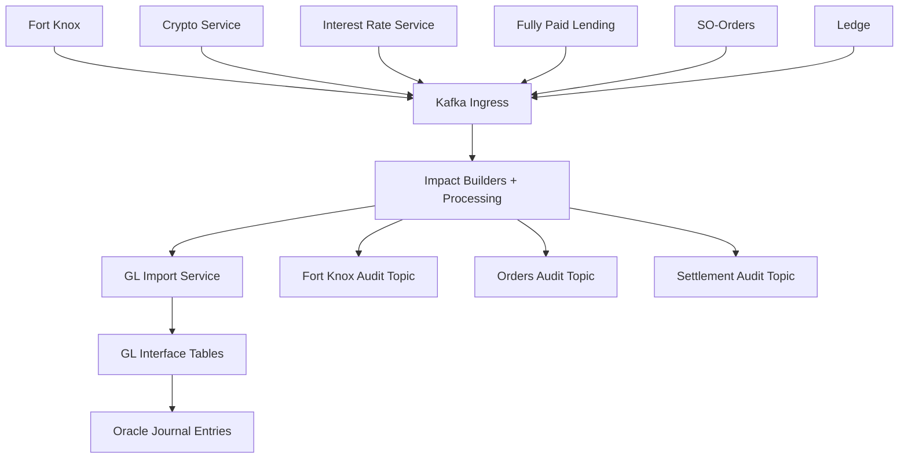
```mermaid
flowchart TD
    FortKnox["Fort Knox"] --> Ingress["Kafka Ingress"]
    CryptoSvc["Crypto Service"] --> Ingress
    InterestSvc["Interest Rate Service"] --> Ingress
    FPL["Fully Paid Lending"] --> Ingress
    Orders["SO-Orders"] --> Ingress
    Ledge["Ledge"] --> Ingress
    Ingress --> Processing["Impact Builders + Processing"]
    Processing --> GLImport["GL Import Service"]
    GLImport --> GLInterface["GL Interface Tables"]
    GLInterface --> JournalEntries["Oracle Journal Entries"]
    Processing --> FKAudit["Fort Knox Audit Topic"]
    Processing --> OrdersAudit["Orders Audit Topic"]
    Processing --> SettlementAudit["Settlement Audit Topic"]
```

---

### 3.10 Accounting Flink Jobs -- Pipeline

**Category:** service

Pipeline Stages: 1) TX Streamer - Load Oracle txns, 2) Activity Classifier - Standardize, 3) Calculators - Positions/returns, 4) Materializers - Write to Kratos.

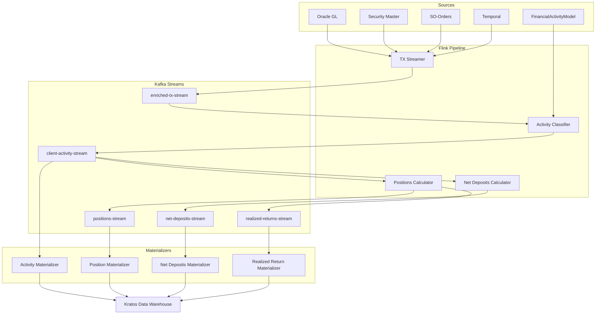
```mermaid
flowchart TD
    subgraph Sources["Sources"]
        Oracle["Oracle GL"]
        SecMaster["Security Master"]
        SOOrders["SO-Orders"]
        FAM["FinancialActivityModel"]
        Temporal["Temporal"]
    end

    subgraph Pipeline["Flink Pipeline"]
        TxStreamer["TX Streamer"]
        ActivityClassifier["Activity Classifier"]
        PositionsCalc["Positions Calculator"]
        NetDeposits["Net Deposits Calculator"]
    end

    subgraph KafkaStreams["Kafka Streams"]
        EnrichedTx["enriched-tx-stream"]
        ClientActivity["client-activity-stream"]
        PositionsStream["positions-stream"]
        NetDepStream["net-deposits-stream"]
        RealizedStream["realized-returns-stream"]
    end

    subgraph Materializers["Materializers"]
        ActivityMat["Activity Materializer"]
        PositionMat["Position Materializer"]
        NetDepMat["Net Deposits Materializer"]
        RealizedMat["Realized Return Materializer"]
    end

    Kratos["Kratos Data Warehouse"]

    Oracle --> TxStreamer
    SecMaster --> TxStreamer
    SOOrders --> TxStreamer
    FAM --> ActivityClassifier
    Temporal --> TxStreamer
    TxStreamer --> EnrichedTx
    EnrichedTx --> ActivityClassifier
    ActivityClassifier --> ClientActivity
    ClientActivity --> PositionsCalc
    ClientActivity --> NetDeposits
    PositionsCalc --> PositionsStream
    PositionsCalc --> RealizedStream
    NetDeposits --> NetDepStream
    ClientActivity --> ActivityMat
    PositionsStream --> PositionMat
    NetDepStream --> NetDepMat
    RealizedStream --> RealizedMat
    ActivityMat --> Kratos
    PositionMat --> Kratos
    NetDepMat --> Kratos
    RealizedMat --> Kratos
```

---

### 3.11 Accounting Flink Jobs -- Flow

**Category:** service (simplified)

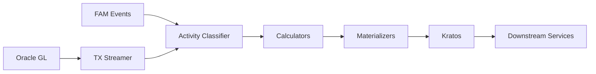
```mermaid
flowchart LR
    Oracle["Oracle GL"] --> TX["TX Streamer"]
    Events["FAM Events"] --> AC["Activity Classifier"]
    TX --> AC
    AC --> Calc["Calculators"]
    Calc --> Mat["Materializers"]
    Mat --> Kratos["Kratos"]
    Kratos --> Downstream["Downstream Services"]
```

---

### 3.12 SO-Orders -- Architecture

**Category:** service

Order Management System: Full order lifecycle management, multi-venue execution (FIX, Bloomberg, Fundserv), 18 deployable modules, hybrid Dropwizard + Spring Boot stack.

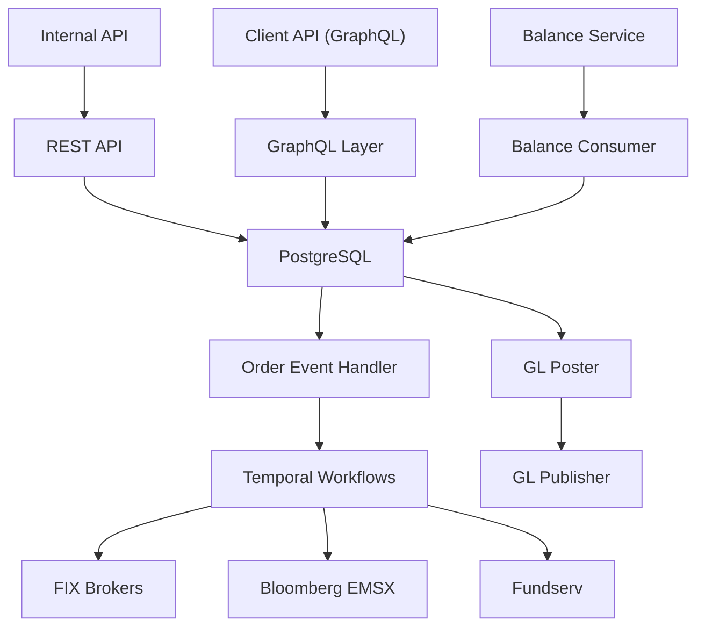
```mermaid
flowchart TD
    Client["Client API (GraphQL)"] --> GraphQL["GraphQL Layer"]
    Internal["Internal API"] --> RestAPI["REST API"]
    RestAPI --> PG["PostgreSQL"]
    GraphQL --> PG
    PG --> OrderHandler["Order Event Handler"]
    OrderHandler --> Workflows["Temporal Workflows"]
    Workflows --> FIX["FIX Brokers"]
    Workflows --> Bloomberg["Bloomberg EMSX"]
    Workflows --> Fundserv["Fundserv"]
    BalanceSvc["Balance Service"] --> BalanceConsumer["Balance Consumer"]
    BalanceConsumer --> PG
    PG --> GLPoster["GL Poster"]
    GLPoster --> GLPublisher["GL Publisher"]
```

---

### 3.13 Fort Knox -- Architecture

**Category:** service

Funding and Money Movement: Deposits, withdrawals, transfers; contribution room tracking (RRSP/TFSA/IRA); payment card management; 63+ modular components.

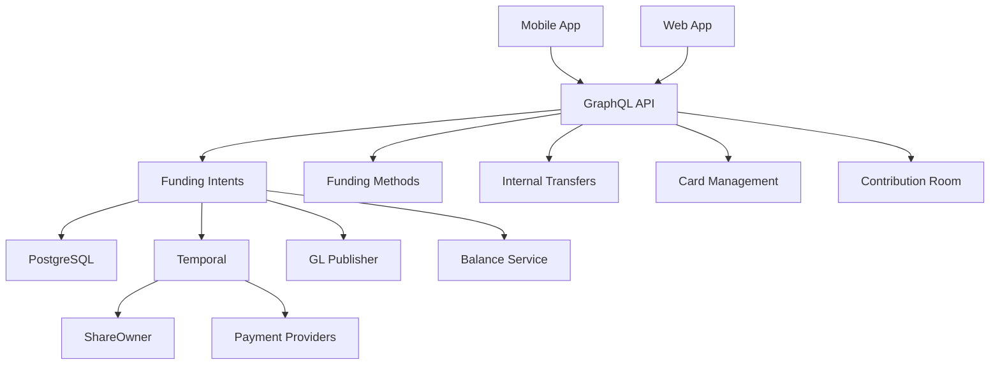
```mermaid
flowchart TD
    Mobile["Mobile App"] --> GraphQL["GraphQL API"]
    Web["Web App"] --> GraphQL
    GraphQL --> FundingIntents["Funding Intents"]
    GraphQL --> FundingMethods["Funding Methods"]
    GraphQL --> InternalTransfers["Internal Transfers"]
    GraphQL --> CardMgmt["Card Management"]
    GraphQL --> ContribRoom["Contribution Room"]
    FundingIntents --> PG["PostgreSQL"]
    FundingIntents --> Temporal["Temporal"]
    Temporal --> ShareOwner["ShareOwner"]
    Temporal --> PaymentProviders["Payment Providers"]
    FundingIntents --> GLPublisher["GL Publisher"]
    FundingIntents --> BalanceSvc["Balance Service"]
```

---

### 3.14 Crypto Service -- Architecture

**Category:** service

Cryptocurrency Platform: Crypto trading (buy/sell), transfers (internal/external), DeFi operations (staking, yield), modular monolith with Packwerk.

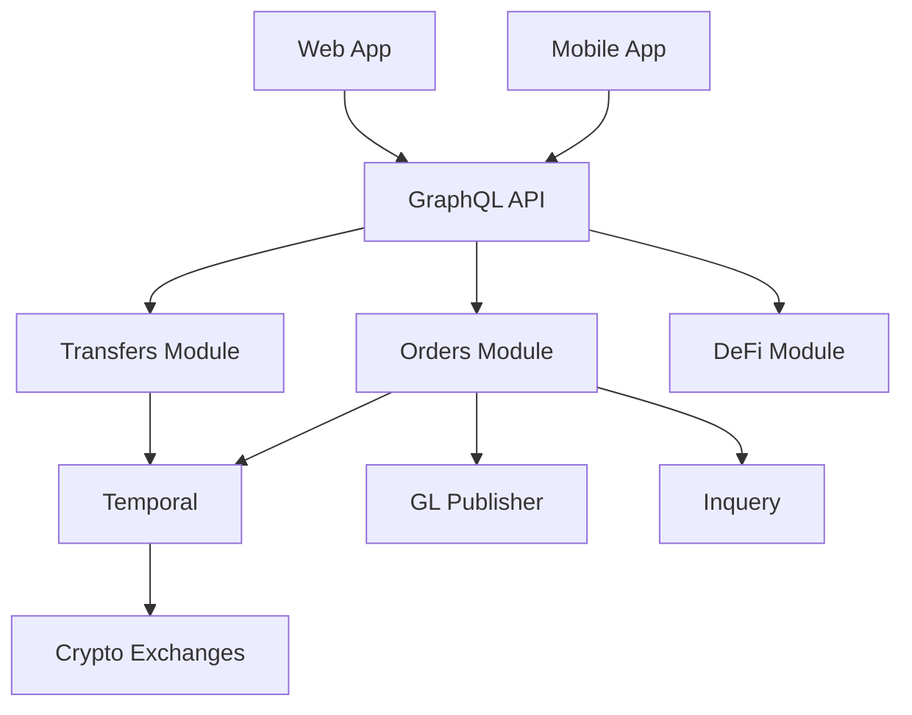
```mermaid
flowchart TD
    Mobile["Mobile App"] --> GraphQL["GraphQL API"]
    Web["Web App"] --> GraphQL
    GraphQL --> Orders["Orders Module"]
    GraphQL --> Transfers["Transfers Module"]
    GraphQL --> DeFi["DeFi Module"]
    Orders --> Temporal["Temporal"]
    Transfers --> Temporal
    Temporal --> CryptoExchange["Crypto Exchanges"]
    Orders --> GLPublisher["GL Publisher"]
    Orders --> Inquery["Inquery"]
```

---

### 3.15 Fully Paid Lending -- Architecture

**Category:** service

Securities Lending Platform: Enables clients to lend securities for interest, Broadridge SFCM integration, mark-to-market automation, Spring Batch file processing.

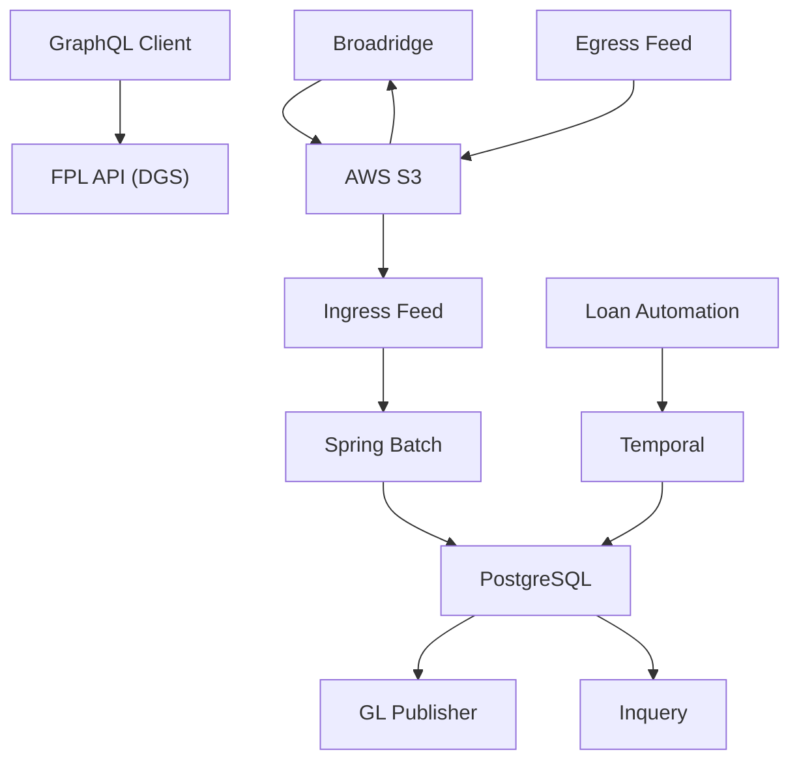
```mermaid
flowchart TD
    GraphQLClient["GraphQL Client"] --> FPLAPI["FPL API (DGS)"]
    Broadridge["Broadridge"] --> S3["AWS S3"]
    S3 --> IngressFeed["Ingress Feed"]
    IngressFeed --> SpringBatch["Spring Batch"]
    SpringBatch --> PG["PostgreSQL"]
    EgressFeed["Egress Feed"] --> S3
    S3 --> Broadridge
    LoanAutomation["Loan Automation"] --> Temporal["Temporal"]
    Temporal --> PG
    PG --> GLPublisher["GL Publisher"]
    PG --> Inquery["Inquery"]
```

---

### 3.16 Inquery -- Architecture

**Category:** service

Presentational Data Layer: Auto-generated GraphQL from PostgreSQL, "informed, not informing" (consumes events), Row-Level Security for authorization, read-optimized for frontends.

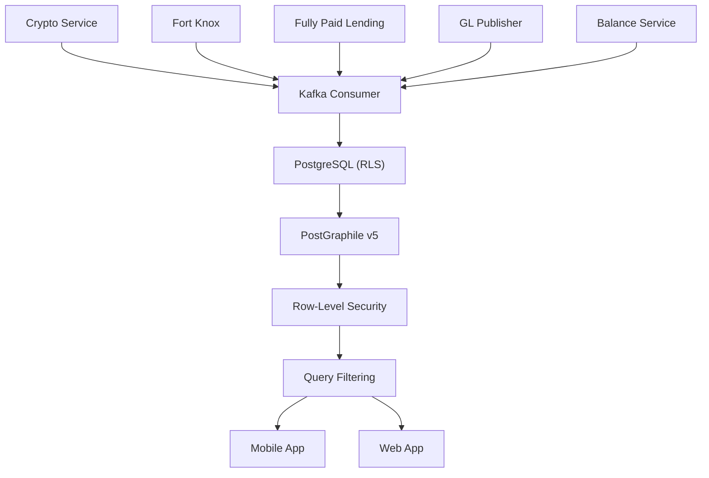
```mermaid
flowchart TD
    CryptoSvc["Crypto Service"] --> KafkaConsumer["Kafka Consumer"]
    FortKnox["Fort Knox"] --> KafkaConsumer
    FPL["Fully Paid Lending"] --> KafkaConsumer
    GLPublisher["GL Publisher"] --> KafkaConsumer
    BalanceSvc["Balance Service"] --> KafkaConsumer
    KafkaConsumer --> PG["PostgreSQL (RLS)"]
    PG --> PostGraphile["PostGraphile v5"]
    PostGraphile --> Auth["Row-Level Security"]
    Auth --> Filtering["Query Filtering"]
    Filtering --> Mobile["Mobile App"]
    Filtering --> Web["Web App"]
```

---

### 3.17 Risk Service -- Architecture

**Category:** service

Fraud, Compliance, Risk: Fraud detection and investigation, risk mitigation (liquidations, restrictions), FINTRAC regulatory reporting, margin supervision.

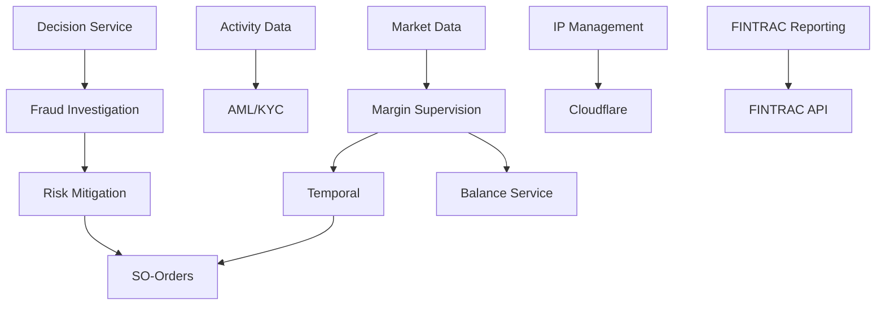
```mermaid
flowchart TD
    DecisionSvc["Decision Service"] --> FraudInvestigation["Fraud Investigation"]
    ActivityData["Activity Data"] --> AML["AML/KYC"]
    MarketData["Market Data"] --> MarginCall["Margin Supervision"]
    FraudInvestigation --> Mitigation["Risk Mitigation"]
    Mitigation --> SOOrders["SO-Orders"]
    MarginCall --> Temporal["Temporal"]
    Temporal --> SOOrders
    IPMgmt["IP Management"] --> Cloudflare["Cloudflare"]
    FINTRAC["FINTRAC Reporting"] --> FINTRACApi["FINTRAC API"]
    MarginCall --> BalanceSvc["Balance Service"]
```

---

### 3.18 Kratos -- Architecture

**Category:** service

Financial Data Warehouse: Stores processed data from Flink pipeline, activities/positions/returns/net deposits, serves Financial Metrics Service and analytics, versioned tables for zero-downtime deployments.

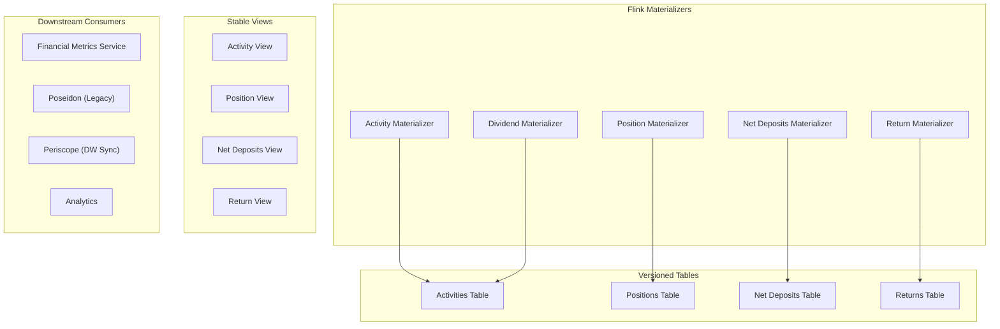
```mermaid
flowchart TD
    subgraph Materializers["Flink Materializers"]
        ActivityMat["Activity Materializer"]
        PositionMat["Position Materializer"]
        NetDepMat["Net Deposits Materializer"]
        ReturnMat["Return Materializer"]
        DividendMat["Dividend Materializer"]
    end

    subgraph Tables["Versioned Tables"]
        Activities["Activities Table"]
        Positions["Positions Table"]
        NetDeposits["Net Deposits Table"]
        Returns["Returns Table"]
    end

    subgraph Views["Stable Views"]
        ActivityView["Activity View"]
        PositionView["Position View"]
        NetDepView["Net Deposits View"]
        ReturnView["Return View"]
    end

    subgraph Consumers["Downstream Consumers"]
        FinMetrics["Financial Metrics Service"]
        Poseidon["Poseidon (Legacy)"]
        Periscope["Periscope (DW Sync)"]
        Analytics["Analytics"]
    end

    ActivityMat --> Activities
    PositionMat --> Positions
    NetDepMat --> NetDeposits
    ReturnMat --> Returns
    DividendMat --> Activities
```

---

### 3.19 Poseidon -- Architecture (Deprecating)

**Category:** service

Legacy Investment API: Polls custodians for investment activities, calculates positions with book values, computes daily values and returns. Being replaced by Flink + Kratos + Financial Metrics.

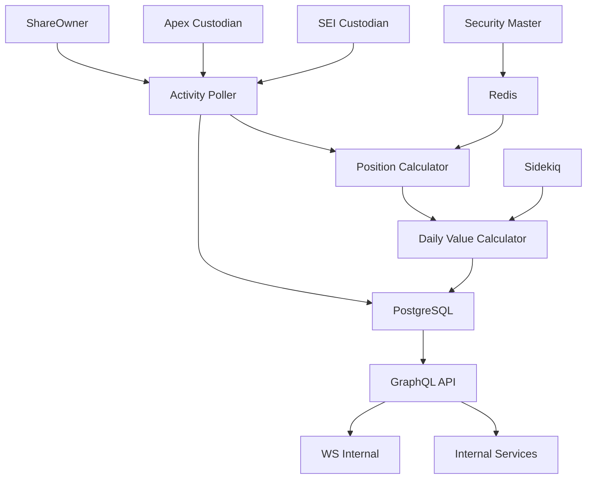
```mermaid
flowchart TD
    ShareOwner["ShareOwner"] --> Poller["Activity Poller"]
    Apex["Apex Custodian"] --> Poller
    SEI["SEI Custodian"] --> Poller
    Poller --> PG["PostgreSQL"]
    Poller --> PositionCalc["Position Calculator"]
    PositionCalc --> DailyValueCalc["Daily Value Calculator"]
    DailyValueCalc --> PG
    SecMaster["Security Master"] --> Redis["Redis"]
    Redis --> PositionCalc
    PG --> GraphQL["GraphQL API"]
    GraphQL --> WS["WS Internal"]
    GraphQL --> Internal["Internal Services"]
    Sidekiq["Sidekiq"] --> DailyValueCalc
```

---

### 3.20 Ledge -- Architecture

**Category:** service

Back-office web application replacing Oracle Forms. GL entries, order posting, and bulk journal uploads through a modern web interface.

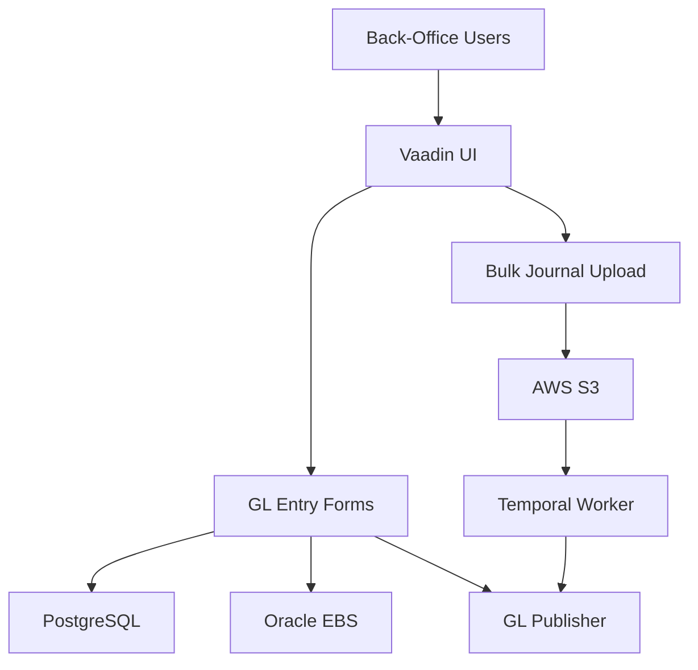
```mermaid
flowchart TD
    BackOffice["Back-Office Users"] --> Vaadin["Vaadin UI"]
    Vaadin --> Forms["GL Entry Forms"]
    Vaadin --> BulkUpload["Bulk Journal Upload"]
    BulkUpload --> S3["AWS S3"]
    S3 --> TemporalWorker["Temporal Worker"]
    TemporalWorker --> GLPublisher["GL Publisher"]
    Forms --> PG["PostgreSQL"]
    Forms --> OracleEBS["Oracle EBS"]
    Forms --> GLPublisher
```

---

### 3.21 Interest Rate Service -- Architecture

**Category:** service

Interest calculation, fee processing, margin interest, and tier management with monthly rollup to the ledger system.

```mermaid
flowchart TD
    Rates["Rate Configuration"] --> InterestComp["Interest Component"]
    Hypercube["Hypercube (DAG)"] --> TierMgmt["Tier Management"]
    Poseidon["Poseidon"] --> InterestComp
    InterestComp --> PG["PostgreSQL"]
    TierMgmt --> PG
    ManualCharges["Manual Charges"] --> PG
    PG --> Ledger["Ledger Entries"]
    InterestComp --> GLPublisher["GL Publisher"]
```

---

### 3.22 Investment Profile Service -- Architecture

**Category:** service

Portfolio management and suitability hub: client assessments, portfolio assignments, investor policy statements, recurring investments.

```mermaid
flowchart TD
    Athena["Athena (Auto Assessment)"] --> Assessments["Assessments"]
    PM["Portfolio Manager"] --> Assessments
    AccountSvc["Account Service"] --> Assignments["Assignments"]
    Assessments --> PG["PostgreSQL"]
    Assignments --> PG
    Portfolios["Target Portfolios"] --> PG
    IPSDocs["IPS Document Gen"] --> S3["AWS S3"]
    RecurringWF["Recurring Investments"] --> ShareOwner["ShareOwner"]
    PG --> GraphQL["GraphQL API"]
```

---

## 4. Stories / Walkthroughs

### 4.1 How Real-Time Balances Work

> **Understand how Balance Service maintains instant buying power without waiting for Oracle.**

#### Step 1: The problem -- Oracle is too slow

Traditional accounting runs through Oracle GL, which can take minutes to process. But when a user wants to buy stock, the app needs to know their buying power instantly. Balance Service solves this by maintaining its own real-time view of account balances, separate from the accounting books.

**Diagram context:** Balance and Position Flow

#### Step 2: Listening to the GL stream

Balance Service's **Transaction Stream Consumer** (`TxConsumer`) subscribes to a Kafka topic fed by Leapfrog (which reads Oracle GL in near real-time). Every GL transaction -- deposits, withdrawals, trades, fees -- is consumed and applied to Balance Service's own PostgreSQL database.

> *TxConsumer: Primary ingestion consumer that processes GL transaction data from Oracle via Leapfrog Shovel. Updates live balances in PostgreSQL.*

**Diagram context:** Balance Service Architecture

#### Step 3: Multi-capsule architecture

Balances are stored across multiple PostgreSQL "capsules" -- **Main**, **Invest**, and **Crypto** -- each scaling independently. This multi-tenancy architecture lets the trading capsule handle high-frequency order checks without impacting crypto or general account queries.

> *PG_Main: PostgreSQL database for Trade (MAIN) product -- live balances, reservations, processed transactions, and margin configurations.*
> *PG_Invest: PostgreSQL database for Invest product -- live balances, reservations, and processed transactions, independently scalable.*
> *PG_Crypto: PostgreSQL database for Crypto product -- live balances, reservations, and processed transactions, independently scalable.*

#### Step 4: Order reservations

When SO-Orders executes a trade, Balance Service's **Order Consumer** (`OrderConsumerV2`) receives the execution event from Kafka. It manages reservations: funds are held when an order is submitted and released when the order fills or cancels. This prevents double-spending -- two concurrent buy orders cannot both spend the same cash.

> *OrderConsumerV2: Processes order execution events from SO-Orders to update balance reservations in real-time. Handles fills, cancellations, and partial fills.*

#### Step 5: Serving balances to the app

The **REST API** (built with Ktor) and **GraphQL API** (Spring DGS) serve balance queries to the mobile app and internal services. For margin accounts, the response includes a full buying power calculation: Cash + Collateral (with haircuts) - Concentration limits.

> *RestAPI: Balance Service REST API (Ktor). Serves atomic check-and-reserve operations for trade execution and balance queries with full breakdowns.*
> *GqlAPI: Balance Service GraphQL API (Spring Boot + DGS). Serves rich balance and margin data to mobile and web apps including buying power and margin metrics.*

#### Step 6: Publishing balance events

When balances change, the **Outbox Poller** publishes events to Kafka using the transactional outbox pattern. This guarantees no balance change is lost -- even if Kafka is temporarily unavailable, the events are safely stored in PostgreSQL and retried. Downstream services like Inquery subscribe to these events.

> *OutboxPoller: Publishes balance change events to Kafka using the transactional outbox pattern, ensuring no events are lost.*
> *BalanceEvents: Kafka topic (balance-events) carrying balance state change events. Consumed by Inquery for client notifications and analytics.*

---

### 4.2 How an Order Gets Placed and Settled

> **Follow a sell order from the mobile app through execution, accounting, and balance updates.**

#### Step 1: The user submits an order

The journey starts when a user taps "Sell" in the Wealthsimple app. The request arrives at the **SO-Orders REST API**, which validates the order parameters -- security, quantity, account eligibility -- and persists it to PostgreSQL with a Pending status.

> *SOOrders: Order execution and management system handling the full order lifecycle from client submission through FIX broker execution.*

**Diagram context:** SO-Orders Architecture

#### Step 2: Balance check and reservation

Before the order can proceed, SO-Orders checks with **Balance Service**: "Does this account actually hold 100 shares of AAPL?" If yes, Balance Service atomically reserves those shares so they cannot be double-sold by a concurrent order.

> *BalanceConsumer: Balance event consumer processing balance updates from Balance Service to validate order eligibility.*

#### Step 3: Order execution via broker

The **Order Event Handler** picks up the pending order and launches a **Temporal Workflow**. The workflow routes the order to the appropriate execution venue -- FIX protocol for direct broker connections, Bloomberg EMSX, or Fundserv for mutual funds. The broker executes the trade and sends back a fill confirmation.

> *Workflows: Temporal workflow orchestration for complex multi-leg orders, error recovery, and durable order processing.*
> *FIX: FIX protocol connections for direct broker communication, routing equity and options orders to market execution venues.*

#### Step 4: Accounting handoff

Once the order is filled, the **Order GL Poster** converts the execution into a standardized financial activity and publishes it to Kafka. This is the handoff from the trading domain into the accounting domain.

> *GLPoster: Posts completed order events to GL Publisher as financial activities for Oracle accounting and ledger booking.*

#### Step 5: The accounting pipeline begins

Zooming out to the accounting domain: the **GL Publisher** sits at the center, receiving activities from multiple upstream services -- not just orders, but also deposits, fees, crypto trades, interest, and lending events.

> *GLPublisher: Mission-critical financial booking hub transforming business activities into Oracle GL journal entries. 60+ activity types, 44+ Impact Builders.*

**Diagram context:** Accounting and GL Flow

#### Step 6: GL Publisher processes the activity

Inside GL Publisher, the **Queue Processor** consumes the activity from Kafka. One of 44+ specialized **Impact Builders** transforms it into debit/credit GL journal entries -- for a sell order: debit the cash account, credit the securities account.

> *QueueProc: Main ingress stream processor consuming activities from Kafka, selecting Impact Builders, and routing to direct, grouped, or batched processing.*
> *ImpactBuilders: 44+ specialized builders transforming financial activities into GL debit/credit entries. Each activity type has a dedicated builder.*

**Diagram context:** Oracle GL Publisher Architecture

#### Step 7: Batched import to Oracle

Because this is an order-related activity, it follows the **Batched path**. GL Publisher waits for the full order batch to complete before importing, ensuring the books balance. The GL Import Service writes the journal entries to Oracle's GL Interface tables.

> *BatchedProc: Handles activities requiring batch completion before GL import. Monitors readiness, waits for all expected activities, then imports.*
> *GLInterface: Oracle GL Interface tables where GL Publisher writes journal entry line items as a staging area for GL import processing.*

#### Step 8: Balance Service gets the update

Meanwhile, Balance Service's **Transaction Stream Consumer** picks up the GL transaction from Kafka (via Leapfrog, which reads from Oracle). It updates the real-time balance in PostgreSQL: the account now shows the cash proceeds from the sale and the reduced share count.

> *TxConsumer: Primary ingestion consumer that processes GL transaction data from Oracle via Leapfrog Shovel. Updates live balances in PostgreSQL.*

**Diagram context:** Balance Service Architecture

#### Step 9: Real-time balances are served

The updated balances are immediately available through Balance Service's REST and GraphQL APIs. The next time the user opens the app, they see their updated cash balance and portfolio -- all within seconds of the order filling.

> *RestAPI: Balance Service REST API (Ktor). Serves atomic check-and-reserve operations for trade execution and balance queries with full breakdowns.*

#### Step 10: Analytics pipeline processes it all

In parallel, the **Accounting Flink Jobs** pipeline picks up the Oracle GL entry. TX Streamer enriches it with market prices and FX rates, Activity Classifier categorizes it as a SELL, and Positions Calculator updates the portfolio analytics. Everything materializes to the **Kratos** data warehouse for reporting.

> *TxStreamer: Flink ingestion job loading transaction batches from Oracle and enriching with market prices, FX rates, and order data.*

**Diagram context:** Accounting Flink Jobs Pipeline

---

## 5. Node Categories

### 5.1 Kafka Topics

These are the Kafka topics that form the event-driven backbone of the ecosystem:

| Node ID | Description |
|---|---|
| `TxStream` | Kafka topic (`transaction-group-poc`) carrying GL transaction data from Oracle via Leapfrog Shovel for real-time balance updates. |
| `OrderActivity` | Kafka topic (`order-activity-event`) carrying order activity state changes from SO-Orders. |
| `OrderExecution` | Kafka topic (`order-execution-event`) carrying order fill, cancellation, and modification events from SO-Orders. |
| `MarginOverride` | Kafka topic (`margin-override-events`) carrying margin configuration changes for collateral settings and margin parameters. |
| `AccountFeature` | Kafka topic (`account-feature-events`) carrying account feature toggles to enable/disable capabilities like margin trading. |
| `BalanceEvents` | Kafka topic (`balance-events`) carrying balance state change events. Consumed by Inquery for client notifications and analytics. |
| `IngressTopic` | Kafka topic (`gl-publisher-tx-ingress-stream`) -- single entry point for all financial activities entering the GL Publisher pipeline. |
| `AuditLite` | Kafka topic (`audit-lite`) -- central audit stream produced by Queue Processor before routing to service-specific topics. |
| `AuditTopics` | Set of 8+ specialized audit Kafka topics notifying upstream services when their activities are booked to Oracle GL. |
| `EnrichedTx` | Internal Kafka topic (`enriched-tx-stream`) carrying Oracle transactions enriched with prices, FX, and order data. |
| `ClientActivity` | Kafka topic (`client-activity-stream`) carrying standardized ClientActivityV2 messages for downstream calculators. |
| `PositionsStream` | Kafka topic (`positions-stream`) carrying calculated positions including quantities, book values, and market values. |
| `NetDepStream` | Kafka topic (`net-deposits-stream`) carrying net deposit metrics -- total deposits, withdrawals, and net. |
| `RealizedStream` | Kafka topic (`realized-returns-stream`) carrying realized PnL data from closed positions. |

### 5.2 APIs

These are the API endpoints exposed by various services:

| Node ID | Description |
|---|---|
| `RestAPI` | Balance Service REST API (Ktor). Serves atomic check-and-reserve operations for trade execution and balance queries with full breakdowns. |
| `GqlAPI` | Balance Service GraphQL API (Spring Boot + DGS). Serves rich balance and margin data to mobile and web apps including buying power and margin metrics. |
| `API` | GL Publisher GraphQL API (Spring Boot + DGS) for reprocessing failed activities, reversals, book value updates, and monitoring. |
| `GraphQL` | GraphQL API endpoint exposing queries and mutations for service data access. |
| `FPLAPI` | GraphQL API (Netflix DGS) for Fully Paid Lending exposing loan positions, interest earnings, and lending status. |
| `PostGraphile` | PostGraphile v5 engine auto-generating a GraphQL schema from Inquery's PostgreSQL tables -- no manual resolvers needed. |

### 5.3 Databases and Storage

These are the data stores used across the ecosystem:

| Node ID | Description |
|---|---|
| `Oracle` | Oracle Database -- enterprise system of record for financial accounting. Stores the General Ledger and all authoritative accounting data. |
| `OracleEBS` | Oracle E-Business Suite providing the General Ledger module. Manages chart of accounts, periods, and journal processing. |
| `GLInterface` | Oracle GL Interface tables where GL Publisher writes journal entry line items as a staging area for GL import processing. |
| `PG_Main` | PostgreSQL database for Trade (MAIN) product -- live balances, reservations, processed transactions, and margin configurations. |
| `PG_Invest` | PostgreSQL database for Invest product -- live balances, reservations, and processed transactions, independently scalable. |
| `PG_Crypto` | PostgreSQL database for Crypto product -- live balances, reservations, and processed transactions, independently scalable. |
| `PG_Balance` | PostgreSQL multi-capsule architecture (MAIN, INVEST, CRYPTO) storing live balances, reservations, and transaction state. |
| `PG` | PostgreSQL relational database used for persistent storage of transactions, positions, configurations, and application state. |
| `Kratos` | PostgreSQL data warehouse storing materialized financial data from the Flink pipeline -- activities, positions, returns, deposits. |
| `Redis` | Redis in-memory store used for caching (price data, session state), background job queues, and rate limiting. |
| `S3` | AWS S3 object storage for file staging (Broadridge feeds, bulk uploads), document caching, and reports. |

---

## 6. Deep Dive: Ledge, Oracle GL Publisher, and SO-Orders

These three services form the core write path for financial data -- from manual ledger entries and automated order execution through to Oracle GL booking.

### 6.1 Relationship Overview

```mermaid
flowchart LR
    subgraph ManualEntry["Manual Entry Path"]
        BackOffice["Back-Office Users"]
        Ledge["Ledge (Vaadin UI)"]
    end

    subgraph TradingPath["Trading Path"]
        Mobile["Mobile / Web"]
        SOOrders["SO-Orders"]
        FIX["FIX Brokers"]
        Bloomberg["Bloomberg"]
        Fundserv["Fundserv"]
    end

    subgraph AccountingHub["Accounting Hub"]
        GLPublisher["Oracle GL Publisher"]
        ImpactBuilders["44+ Impact Builders"]
        GLService["GL Import Service"]
    end

    subgraph SystemOfRecord["System of Record"]
        Oracle["Oracle GL"]
    end

    BackOffice --> Ledge
    Ledge --> GLPublisher
    Ledge --> Oracle

    Mobile --> SOOrders
    SOOrders --> FIX
    SOOrders --> Bloomberg
    SOOrders --> Fundserv
    SOOrders --> GLPublisher

    GLPublisher --> ImpactBuilders
    ImpactBuilders --> GLService
    GLService --> Oracle
```

### 6.2 Ledge

| | |
|---|---|
| **Service ID** | `ledge` |
| **Role in the Triad** | Manual entry point for back-office ledger operations |
| **Tech Stack** | Kotlin, Spring Boot 3.5.x, Vaadin Flow, Temporal, PostgreSQL, Oracle EBS, Gradle |

Ledge is the **manual entry gateway** into the GL system. Back-office users use its Vaadin web UI for:

- **Interactive GL entries** via the Forms module -- journal adjustments, corrections, and new entries
- **Bulk journal uploads** -- CSV files uploaded to S3, then processed by Temporal workflows
- **Direct Oracle EBS access** -- reads/writes to Oracle for form data and validation

**How Ledge connects to the other two:**
- Ledge publishes financial activities to **Oracle GL Publisher** via the Kafka ingress topic (`gl-publisher-tx-ingress-stream`), following the same path as all other upstream services
- Ledge also has **direct Oracle EBS connectivity** for reading chart of accounts, periods, and existing journal data
- The **Temporal Worker** handles bulk CSV processing with retry semantics before posting to GL Publisher

**Internal components:**

| Component | Description |
|---|---|
| `Vaadin` | Vaadin Flow server-side UI framework -- rich web forms with minimal JavaScript, business logic in Kotlin/Java. |
| `Forms` | Main Vaadin web application module for interactive GL journal entries, adjustments, and corrections. |
| `BulkUpload` | CSV-based bulk journal upload -- files uploaded to S3, processed by Temporal workflows with error tracking. |
| `TemporalWorker` | Temporal workflow worker processing bulk CSV ingestion with retry semantics and GL Publisher posting. |

**Appears in diagrams:** All Services Overview, Accounting and GL Flow, Oracle GL Publisher Flow, Ledge Architecture.

---

### 6.3 Oracle GL Publisher

| | |
|---|---|
| **Service ID** | `oracle-gl-publisher` |
| **Role in the Triad** | Central accounting hub transforming all financial activities into Oracle GL entries |
| **Tech Stack** | Kotlin 2.3.0, Spring Boot 3.5.7, Maven, Apache Kafka, Confluent Schema Registry, Netflix DGS, PostgreSQL, Oracle, Hibernate 6.3, Liquibase |

Oracle GL Publisher is the **mission-critical financial booking hub**. Every financial activity in the ecosystem -- whether from trading, funding, crypto, interest, lending, or manual entry -- passes through GL Publisher to become an Oracle GL journal entry.

**How GL Publisher connects to the other two:**
- Receives **order activities from SO-Orders** via Kafka, routes them through the **Batched Activities Processor** (because order-related activities must batch-complete before GL import)
- Receives **manual entries from Ledge** via Kafka, routes them through the appropriate processing path
- Sends **audit confirmations** back to SO-Orders (via the Orders Audit Topic) and other upstream services so they know when their activities are booked

**Processing paths:**

| Path | When Used | Description |
|---|---|---|
| **Direct Write** | Immediate, low-volume activities | Queue Processor writes directly to Oracle via GL Service |
| **Grouped Import** | Funding, interest, lending activities | Groups similar NEW-status activities and imports as a single batch |
| **Batched Import** | Order-related activities | Waits for all activities in a batch to arrive before importing |

**Internal components:**

| Component | Description |
|---|---|
| `QueueProc` | Main ingress stream processor consuming activities from Kafka, selecting Impact Builders, and routing to direct, grouped, or batched processing. |
| `ImpactBuilders` | 44+ specialized builders transforming financial activities into GL debit/credit entries. Each activity type has a dedicated builder. |
| `GroupedProc` | Optimizes GL imports by grouping NEW activities by type and importing each group as a single Oracle GL batch. |
| `BatchedProc` | Handles activities requiring batch completion before GL import. Monitors readiness, waits for all expected activities, then imports. |
| `GLService` | GL Import Service writing journal entries to Oracle GL Interface tables. Handles rate-limited Oracle writes and batch imports. |
| `API` | GL Publisher GraphQL API (Spring Boot + DGS) for reprocessing failed activities, reversals, book value updates, and monitoring. |
| `AuditProc` | Routes audit events from central audit-lite topic to 8+ service-specific Kafka topics so upstream services know when activities are booked. |

**Appears in diagrams:** All Services Overview, Orders and Trading Flow, Funding and Lending Flow, Oracle GL Publisher Architecture, Oracle GL Publisher Flow, SO-Orders Architecture, Fort Knox Architecture, Crypto Service Architecture, Fully Paid Lending Architecture, Inquery Architecture, Ledge Architecture, Interest Rate Service Architecture.

---

### 6.4 SO-Orders

| | |
|---|---|
| **Service ID** | `so-orders` |
| **Role in the Triad** | Automated order execution and trade lifecycle management |
| **Tech Stack** | Java 21, Kotlin, Dropwizard/Guice (legacy), Spring Boot 3.5.7 (new), Maven, PostgreSQL, Oracle, Kafka, SQS, Temporal |

SO-Orders is the **trading engine**. It handles the full order lifecycle -- from a user tapping "Buy" in the app through broker execution to settlement and accounting.

**How SO-Orders connects to the other two:**
- After an order is filled, the **GL Poster** module publishes the completed order as a financial activity to **Oracle GL Publisher** via Kafka for GL booking
- SO-Orders receives **audit confirmations** from GL Publisher's Orders Audit Topic, confirming when order activities are successfully booked to Oracle
- SO-Orders interacts with **Balance Service** (not Ledge) for real-time fund reservation and validation

**Order execution venues:**

| Venue | Use Case |
|---|---|
| **FIX Brokers** | Direct equity and options order execution |
| **Bloomberg EMSX** | Electronic execution management via Bloomberg's brokerage network |
| **Fundserv** | Mutual fund buy/sell/switch transactions |

**Internal components:**

| Component | Description |
|---|---|
| `Client` | External-facing API layer (GraphQL/REST) accepting order submissions from mobile and web clients. |
| `Internal` | Internal service API used by other Wealthsimple services to submit and manage orders programmatically. |
| `OrderHandler` | Kafka event consumer processing order state transitions and coordinating execution across trading venues. |
| `Workflows` | Temporal workflow orchestration for complex multi-leg orders, error recovery, and durable order processing. |
| `GLPoster` | Posts completed order events to GL Publisher as financial activities for Oracle accounting and ledger booking. |
| `BalanceConsumer` | Balance event consumer processing balance updates from Balance Service to validate order eligibility. |
| `BatchHandler` | SQS-based batch processing module handling bulk order operations via the order-batch-handler queue. |
| `Monitors` | Health and metrics monitoring module tracking order processing performance and system status. |
| `InventoryConsumer` | Real-time inventory event consumer processing updates to keep order availability in sync. |

**Appears in diagrams:** All Services Overview, Orders and Trading Flow, Accounting and GL Flow, Balance and Position Flow, Balance Service Architecture, Balance Service Data Flow, Accounting Flink Jobs Pipeline, Risk Service Architecture.

---

### 6.5 How They Connect

The three services interact at well-defined boundaries:

**Ledge -> Oracle GL Publisher:**
- Ledge publishes manual GL entries and bulk journal activities to the `gl-publisher-tx-ingress-stream` Kafka topic
- GL Publisher's Queue Processor consumes these activities, selects the appropriate Impact Builder, and routes to the correct processing path
- Ledge also has direct Oracle EBS access for reading existing GL data and chart-of-accounts validation

**SO-Orders -> Oracle GL Publisher:**
- SO-Orders' GL Poster publishes completed order activities to the same `gl-publisher-tx-ingress-stream` Kafka topic
- Because order activities must batch-complete, they are routed to the **Batched Activities Processor** rather than the grouped path
- GL Publisher sends booking confirmations back to SO-Orders via the **Orders Audit Topic**

**Ledge and SO-Orders (indirect relationship):**
- Ledge and SO-Orders do not directly communicate
- They both feed into Oracle GL Publisher independently
- Both services' activities ultimately land in Oracle GL, flow through the Flink pipeline to Kratos, and are reflected in Balance Service's real-time balances
- Back-office users may use Ledge to make manual corrections to entries originally created by SO-Orders (e.g., journal adjustments for trade settlement issues)

```mermaid
flowchart TD
    subgraph Producers["Activity Producers"]
        Ledge["Ledge\n(Manual GL Entries)"]
        SOOrders["SO-Orders\n(Trade Activities)"]
        OtherSources["Fort Knox, Crypto,\nInterest, FPL"]
    end

    IngressTopic["Kafka:\ngl-publisher-tx-ingress-stream"]

    subgraph GLPub["Oracle GL Publisher"]
        QueueProc["Queue Processor"]
        ImpactBuilders["Impact Builders"]
        GroupedProc["Grouped Processor"]
        BatchedProc["Batched Processor"]
        GLService["GL Import Service"]
        AuditProc["Audit Processor"]
    end

    subgraph Audit["Audit Topics"]
        OrdersAudit["Orders Audit"]
        FKAudit["Fort Knox Audit"]
        SettlementAudit["Settlement Audit"]
    end

    Oracle["Oracle GL"]
    BalanceSvc["Balance Service"]

    Ledge --> IngressTopic
    SOOrders --> IngressTopic
    OtherSources --> IngressTopic
    Ledge -.->|direct read/write| Oracle

    IngressTopic --> QueueProc
    QueueProc --> ImpactBuilders
    ImpactBuilders --> GroupedProc
    ImpactBuilders --> BatchedProc
    GroupedProc --> GLService
    BatchedProc --> GLService
    GLService --> Oracle
    QueueProc --> AuditProc
    AuditProc --> OrdersAudit
    AuditProc --> FKAudit
    AuditProc --> SettlementAudit
    OrdersAudit -.->|confirmation| SOOrders

    Oracle -->|via Leapfrog| BalanceSvc
```

---

*End of System Map. Generated from archviz-summary.json and archviz-data.json.*
